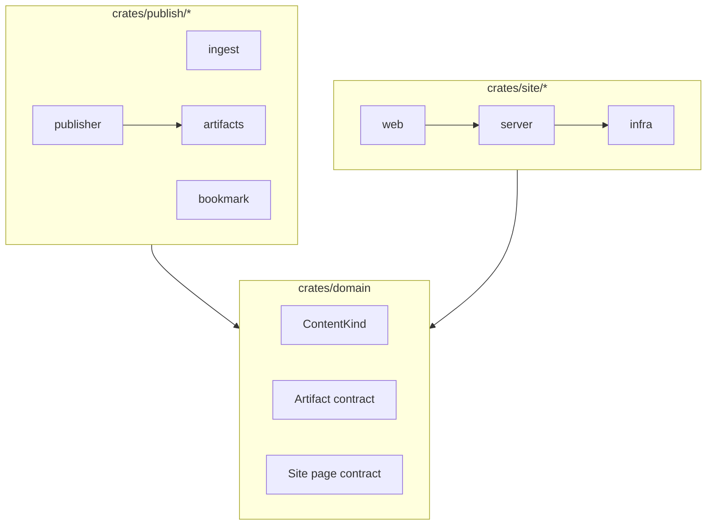
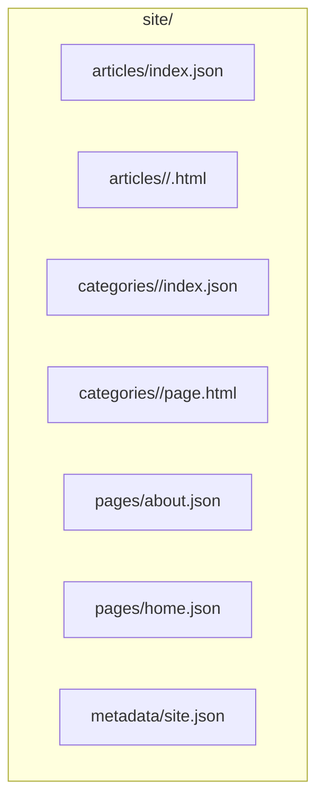
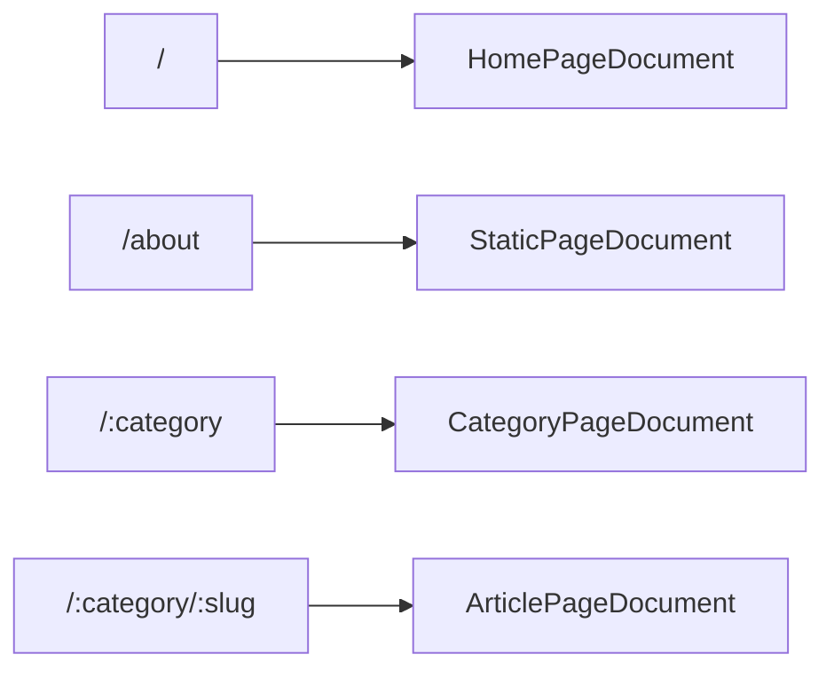

# okawak_blog アーキテクチャ

## 目的

`okawak_blog` は、Obsidian で書いた Markdown を公開成果物へ変換し、それを Leptos SSR で配信するための静的コンテンツ公開基盤 + SSR 表示基盤である。

このリポジトリは一般的なブログ CMS ではない。主役は常駐 API サーバーではなく、publisher による公開成果物生成パイプラインである。

## システム概要

公開フローは次の通り。

1. private な Obsidian リポジトリを git submodule として取得する
2. `crates/publish/ingest` が Markdown と frontmatter を解釈する
3. `crates/publish/publisher` が記事、カテゴリ、固定ページ、home fragment を artifact に変換する
4. `crates/publish/artifacts` が `site/` 配下の HTML / JSON を組み立てる
5. GitHub Actions が artifact を S3 に配置する
6. `crates/site/server` と `crates/site/web` が `crates/site/infra` 経由で artifact を読んで SSR する

Markdown から HTML への変換はビルド時に完了させる。ランタイムは artifact の読取、ルーティング、メタ情報の付与に集中する。

```mermaid
flowchart LR
    A[Private Obsidian Repo] --> B[git submodule]
    B --> C[crates/publish/ingest]
    C --> D[crates/publish/publisher]
    D --> E[crates/publish/artifacts]
    E --> F[site artifact directory]
    F --> G[GitHub Actions upload]
    G --> H[S3]
    H --> I[crates/site/infra]
    I --> J[crates/site/server]
    J --> K[crates/site/web]
    K --> L[Browser]
```



## ワークスペース構成

```text
okawak_blog/
├── crates/
│   ├── domain/
│   ├── publish/
│   │   ├── publisher/
│   │   ├── ingest/
│   │   ├── artifacts/
│   │   └── bookmark/
│   └── site/
│       ├── infra/
│       ├── server/
│       └── web/
├── docs/
│   └── architecture/
├── service/
└── terraform/
```

各 crate の責務は次の通り。

- `crates/domain`
  - publisher と reader が共有する純粋契約
  - `ContentKind`、`Category`、`Slug`、`PageKey`
  - artifact contract
  - site page contract
- `crates/publish/ingest`
  - Obsidian vault の走査
  - frontmatter の parse / validation
  - Markdown body の抽出
  - Obsidian link 解決
  - Markdown -> HTML 変換
- `crates/publish/bookmark`
  - 外部 HTTP を伴う bookmark enrichment
- `crates/publish/publisher`
  - content kind ごとの公開物生成
  - `section_path` の導出
  - article/category/page/home の artifact 生成
- `crates/publish/artifacts`
  - `site/` 配下の HTML / JSON 書き出し
  - category fallback page 生成
- `crates/site/infra`
  - `ArtifactReader` 境界
  - local reader
  - S3 reader
- `crates/site/server`
  - artifact 読取 API
  - Axum + Leptos SSR の統合バックエンド
- `crates/site/web`
  - Leptos UI
  - route 定義
  - metadata / canonical / Open Graph 生成

`terraform/` は読み取り専用とし、このリポジトリの通常作業では編集しない。



## コンテンツモデル

### frontmatter

publisher が扱う Markdown は YAML frontmatter を持つ。役割判定には `kind` を使う。

採用している `kind` は次の 4 種類。

- `article`
  - 通常記事
  - `kind` 省略時の default
- `category`
  - カテゴリ landing page
- `page`
  - 固定ページ
- `home`
  - home 用 fragment

共通 frontmatter フィールド:

- `title`
- `kind`
- `summary`
- `is_completed`
- `priority`
- `created`
- `updated`
- `tags`

kind ごとの追加フィールド:

- `article`
  - `category`
- `category`
  - `category`
- `page`
  - `page`
- `home`
  - 追加フィールドなし

記事として扱う Markdown の例:

```yaml
---
title: "Rust Performance Notes"
kind: article
tags: ["rust", "performance"]
summary: "Short summary shown in lists and metadata."
is_completed: true
priority: 1
created: "2025-01-15T10:00:00+09:00"
updated: "2025-01-16T09:30:00+09:00"
category: "tech"
---
```

固定ページの例:

```yaml
---
title: "About"
kind: page
page: about
is_completed: true
created: "2025-01-15T10:00:00+09:00"
updated: "2025-01-16T09:30:00+09:00"
---
```

### ディレクトリ構造と `section_path`

category 配下のディレクトリ構造は frontmatter に重ねて書かず、publisher が path から `section_path` を導出する。

例:

```text
Publish/
  tech/
    landing.md
    rust/
      async/
        future.md
    web/
      leptos.md
```

この場合:

- `tech/landing.md`
  - `kind=category`
  - category landing page
- `tech/rust/async/future.md`
  - `kind=article`
  - `category=tech`
  - `section_path=["rust", "async"]`
- `tech/web/leptos.md`
  - `kind=article`
  - `category=tech`
  - `section_path=["web"]`

`section_path` は category page 上の grouped navigation に使う。Phase 3 では URL には含めない。

Obsidian 側で実際に書く frontmatter とディレクトリ構造のテンプレートは [docs/content/obsidian-template.md](../content/obsidian-template.md) を参照する。

## Artifact 契約

publisher は次の構造で `site/` を生成する。

```text
site/
├── articles/
│   ├── <category>/
│   │   └── <slug>.html
│   └── index.json
├── categories/
│   ├── <category>/
│   │   ├── index.json
│   │   └── page.html
│   └── ...
├── pages/
│   ├── about.json
│   ├── home.json
│   └── ...
└── metadata/
    └── site.json
```

artifact の意味は次の通り。

- `articles/<category>/<slug>.html`
  - 記事本文 HTML
- `articles/index.json`
  - 全記事の一覧
- `categories/<category>/index.json`
  - そのカテゴリ配下の記事一覧
  - `section_path` を含む
- `categories/<category>/page.html`
  - カテゴリ landing page 本文
  - landing Markdown が無い場合は fallback HTML を生成する
- `pages/<page>.json`
  - 固定ページまたは home fragment
  - HTML 本文と title / description / updated_at を含む
- `metadata/site.json`
  - 総記事数とカテゴリ集計

`PageArtifactDocument` は HTML を JSON に包んで保持する。`about` と `home` は reader 側で同じページ artifact 契約を共有する。



## 公開 URL

公開 URL は次の 4 系統。

- `/`
  - home
- `/about`
  - 固定ページ
- `/:category`
  - category landing page + article list
- `/:category/:slug`
  - article detail

`/articles/:slug` や `/categories/:category` は旧構造であり、現行の主要 route ではない。



## Site 表示モデル

`crates/domain/src/site_page.rs` に、artifact から組み立てる pure な page contract を置く。

主な document は次の通り。

- `HomePageDocument`
  - 最近の記事一覧
  - カテゴリ集計
  - optional な `fragment`
- `ArticlePageDocument`
  - 記事メタデータ
  - 本文 HTML
- `CategoryPageDocument`
  - category landing HTML
  - 記事一覧
  - `section_path` ごとの grouped section
- `StaticPageDocument`
  - `about` や `home` fragment の共通 page contract

`site/web` はこの page contract をもとに metadata と UI を組み立てる。reader や storage 実装には依存しない。

## Reader 経路

artifact の読取は `ArtifactReader` 境界を経由する。

- local reader
  - dev / test 用
  - `mise` のローカル task で利用
- S3 reader
  - 本番用
  - `service/okawak_blog.service` 側の env で選択

reader 側の設定は主に次の env で切り替える。

- `OKAWAK_BLOG_ARTIFACT_SOURCE`
  - `local` or `s3`
- `OKAWAK_BLOG_ARTIFACT_LOCAL_ROOT`
- `OKAWAK_BLOG_ARTIFACT_BUCKET`
- `OKAWAK_BLOG_ARTIFACT_PREFIX`

`OKAWAK_BLOG_SITE_ORIGIN` は canonical / Open Graph 用の absolute URL 生成に使う。

## ローカル開発と本番運用

ローカルでは `mise` task を使い、publisher が出力した local artifact をそのまま読む。

```text
Obsidian submodule
  -> mise run publish-local
  -> crates/publish/publisher/dist/site
  -> mise run dev / build-local
```

本番では GitHub Actions が artifact を S3 に置き、VPS 上の単一バイナリがそれを読む。

```text
Obsidian submodule
  -> GitHub Actions publisher
  -> S3
  -> systemd service
  -> nginx
  -> Browser
```

S3 upload は Rust アプリに持たせず、workflow の責務として扱う。

## 非目標

現時点の非目標は次の通り。

- DB ベースの記事管理
- ユーザー認証・認可
- 管理画面
- ブラウザ UI からの記事作成・編集
- マルチユーザー機能
- SaaS 的 CMS 機能
- リアルタイム更新

検索、配信最適化、ETag、キャッシュ戦略の拡張は別 Issue で扱う。
