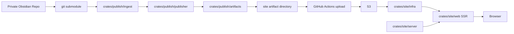
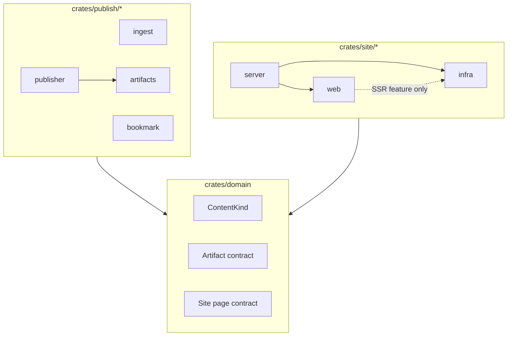
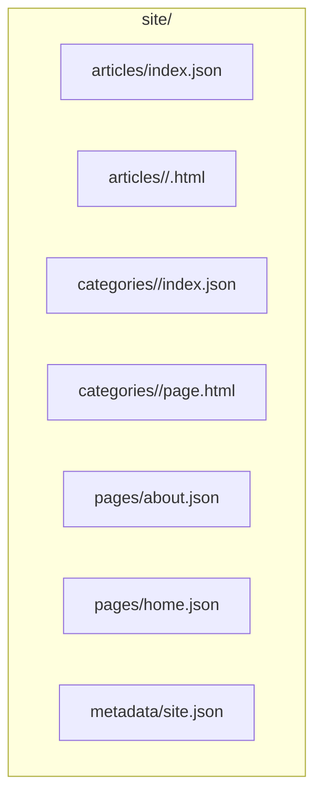
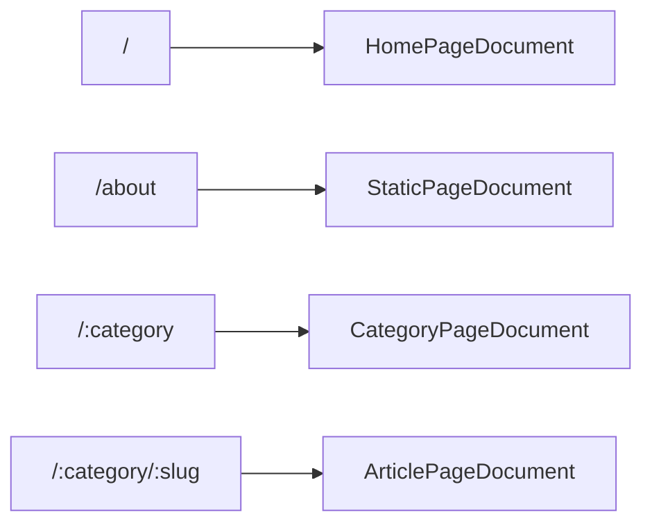

# okawak_blog アーキテクチャ

## 目的

`okawak_blog` は、Obsidian で書いた Markdown を公開成果物へ変換し、それを Leptos SSR で配信するための静的コンテンツ公開基盤 + SSR 表示基盤である。

このリポジトリは一般的なブログ CMS ではない。主役は常駐 API サーバーではなく、publisher による公開成果物生成パイプラインである。

## システム概要

公開フローは次の通り。

1. private な Obsidian リポジトリを git submodule として取得する
2. `crates/publish/ingest` が Markdown と frontmatter を解釈する
3. `crates/publish/publisher` が記事、カテゴリ、固定ページ、home fragment を artifact に変換する
4. `crates/publish/artifacts` が `site/` 配下の HTML / JSON を組み立てる
5. GitHub Actions が artifact を immutable release として S3 に配置し、`current.json` を最後に切り替える
6. `crates/site/server` と `crates/site/web` が `crates/site/infra` 経由で release snapshot を読んで SSR する

Markdown から HTML への変換はビルド時に完了させる。ランタイムは artifact の読取、ルーティング、メタ情報の付与に集中する。



## ワークスペース構成

```text
okawak_blog/
├── crates/
│   ├── domain/
│   ├── publish/
│   │   ├── publisher/
│   │   ├── ingest/
│   │   ├── artifacts/
│   │   └── bookmark/
│   └── site/
│       ├── infra/
│       ├── server/
│       └── web/
├── e2e/
├── docs/
│   └── architecture/
├── service/
└── terraform/
```

各 crate の責務は次の通り。

- `crates/domain`
  - publisher と reader が共有する純粋契約
  - `ContentKind`、`Category`、`Slug`、`PageKey`
  - artifact contract
  - site page contract
- `crates/publish/ingest`
  - Obsidian vault の走査
  - frontmatter の parse / validation
  - Markdown body の抽出
  - Obsidian link 解決
  - Markdown -> HTML 変換
- `crates/publish/bookmark`
  - 外部 HTTP を伴う bookmark enrichment
- `crates/publish/publisher`
  - content kind ごとの公開物生成
  - `section_path` の導出
  - article/category/page/home の artifact 生成
- `crates/publish/artifacts`
  - `site/` 配下の HTML / JSON 書き出し
  - category fallback page 生成
- `crates/site/infra`
  - `ArtifactReader` 境界
  - local reader
  - S3 reader
- `crates/site/server`
  - Axum + Leptos SSR のホスト
  - reader の生成と Leptos context への注入
  - 互換用の記事一覧 API
  - process liveness (`/api/health`) と artifact readiness (`/api/ready`)
  - release-aware ETag と conditional GET
- `crates/site/web`
  - Leptos UI
  - route 定義
  - Leptos server function による page document の組み立て
  - SSR feature 時のみ `ArtifactReader` 境界を利用
  - metadata / canonical / Open Graph 生成
- `e2e`
  - `crates/site/server`、`crates/site/web`、`crates/site/infra` をまたぐ browser E2E
  - 通常CIではprivate Obsidian submoduleやS3に依存しない固定artifact fixture
  - 実S3の検証は専用Playwright configを使い、ローカル手動確認とrelease公開前smoke testへ分離
  - Bun で依存を管理し、Playwright + Chromium で公開 route、metadata、hydration を検証

`terraform/` は読み取り専用とし、このリポジトリの通常作業では編集しない。



## コンテンツモデル

### frontmatter

publisher が扱う Markdown は YAML frontmatter を持つ。役割判定には `kind` を使う。

採用している `kind` は次の 4 種類。

- `article`
  - 通常記事
  - `kind` 省略時の default
- `category`
  - カテゴリ landing page
- `page`
  - 固定ページ
- `home`
  - home 用 fragment

共通 frontmatter フィールド:

- `title`
- `kind`
- `summary`
- `is_completed`
- `priority`
- `created`
- `updated`
- `tags`

kind ごとの追加フィールド:

- `article`
  - `category`
- `category`
  - `category`
- `page`
  - `page`
- `home`
  - 追加フィールドなし

記事として扱う Markdown の例:

```yaml
---
title: "Rust Performance Notes"
kind: article
tags: ["rust", "performance"]
summary: "Short summary shown in lists and metadata."
is_completed: true
priority: 1
created: "2025-01-15T10:00:00+09:00"
updated: "2025-01-16T09:30:00+09:00"
category: "tech"
---
```

固定ページの例:

```yaml
---
title: "About"
kind: page
page: about
is_completed: true
created: "2025-01-15T10:00:00+09:00"
updated: "2025-01-16T09:30:00+09:00"
---
```

### ディレクトリ構造と `section_path`

category 配下のディレクトリ構造は frontmatter に重ねて書かず、publisher が path から `section_path` を導出する。

例:

```text
Publish/
  tech/
    landing.md
    rust/
      async/
        future.md
    web/
      leptos.md
```

この場合:

- `tech/landing.md`
  - `kind=category`
  - category landing page
- `tech/rust/async/future.md`
  - `kind=article`
  - `category=tech`
  - `section_path=["rust", "async"]`
- `tech/web/leptos.md`
  - `kind=article`
  - `category=tech`
  - `section_path=["web"]`

`section_path` は category page 上の grouped navigation に使う。Phase 3 では URL には含めない。

Obsidian 側で実際に書く frontmatter とディレクトリ構造のテンプレートは [docs/content/obsidian-template.md](../content/obsidian-template.md) を参照する。

## Artifact 契約

publisher は次の構造で `site/` を生成する。

```text
site/
├── articles/
│   ├── <category>/
│   │   └── <slug>.html
│   └── index.json
├── categories/
│   ├── <category>/
│   │   ├── index.json
│   │   └── page.html
│   └── ...
├── pages/
│   ├── about.json
│   ├── home.json
│   └── ...
└── metadata/
    └── site.json
```

artifact の意味は次の通り。

- `articles/<category>/<slug>.html`
  - 記事本文 HTML
- `articles/index.json`
  - 全記事の一覧
- `categories/<category>/index.json`
  - そのカテゴリ配下の記事一覧
  - `section_path` を含む
- `categories/<category>/page.html`
  - カテゴリ landing page 本文
  - landing Markdown が無い場合は fallback HTML を生成する
- `pages/<page>.json`
  - 固定ページまたは home fragment
  - HTML 本文と title / description / updated_at を含む
- `metadata/site.json`
  - 総記事数とカテゴリ集計

`PageArtifactDocument` は HTML を JSON に包んで保持する。`about` と `home` は reader 側で同じページ artifact 契約を共有する。

### S3 release 契約

本番uploadは既存キーを上書きせず、次の構造へrelease単位で配置する。

```text
current.json
releases/
└── <release-id>/
    ├── manifest.json
    └── site/
        ├── articles/
        ├── categories/
        ├── pages/
        └── metadata/
```

`current.json`とreleaseごとの`manifest.json`は同じ`ArtifactReleasePointerDocument`を使い、schema version、release ID、artifact prefix、publisher commit、Obsidian source commit、RFC 3339 UTCの生成時刻を保持する。公開workflowは`main`からの`workflow_dispatch`だけで明示的に起動し、定期実行やローカルからの直接syncは標準経路にしない。repository単位のconcurrency groupと`queue: max`で公開runを直列化し、実行中runと待機中runをcancelしない。`site/`のuploadとobject数検証を終え、release prefixを直接読むbrowser E2Eが成功した後、runのpublisher commitがremote `main`の最新commitと一致することを再確認してから`current.json`を最後に更新する。古いrunはimmutable releaseを残して失敗し、公開pointerには触れない。これによりreaderは更新途中または表示検証に失敗したreleaseを公開対象として選ばず、待機runの処理順によって公開pointerが古いreleaseへ戻ることも防ぐ。



## 公開 URL

公開 URL は次の 4 系統。

- `/`
  - home
- `/about`
  - 固定ページ
- `/:category`
  - category landing page + article list
- `/:category/:slug`
  - article detail

`/articles/:slug` や `/categories/:category` は旧構造であり、現行の主要 route ではない。



## Site 表示モデル

`crates/domain/src/site_page.rs` に、artifact から組み立てる pure な page contract を置く。

主な document は次の通り。

- `HomePageDocument`
  - 最近の記事一覧
  - カテゴリ集計
  - optional な `fragment`
- `ArticlePageDocument`
  - 記事メタデータ
  - 本文 HTML
- `CategoryPageDocument`
  - category landing HTML
  - 記事一覧
  - `section_path` ごとの grouped section
- `StaticPageDocument`
  - `about` や `home` fragment の共通 page contract

`site/web` はこの page contract をもとに metadata と UI を組み立てる。SSR feature では Leptos context から `DynArtifactReader` を受け取り、server function の開始時にsnapshotを1回取得してpage documentを組み立てる。local / S3 などの storage 実装詳細には依存しない。hydrate build は `infra` に依存しない。

公開 route の page document 読み込みは Leptos server function を正式経路とする。`site/server` は reader を生成して context に注入し、SSR と server function をホストする。手書きの `/api/page/*` は持たず、404 と storage error の扱いは各 server function に集約する。`/api/articles` は page document を組み立てない互換 endpoint として維持する。

home、about、category、articleの公開routeは`SsrMode::Async`で描画する。title、canonical、Open Graph metadataがartifactの内容に依存するため、非同期resourceの解決前に`<head>`をstreamingしない。各routeではblocking resourceを使い、metadataと本文を同じ`Suspense`境界で組み立てる。

## UI styling境界

`site/web`のUIはRust/UI由来のprimitiveとTailwind CSSを主系にする。

- `src/components/ui/`
  - Rust/UI registry由来の汎用primitive
  - site固有のlayoutや文言を持たない
- `src/components/`と`src/routes/`
  - Tailwind classでsite chrome、page layout、responsive designを構成する
- `style/tailwind.css`
  - semantic color、radius、typography、site layout tokenとbase styleのsource of truth
- `style/content.css`
  - article、about、category landing、home fragmentの生成HTMLだけを`.content-prose`配下で整形するplain CSS
  - heading、code、table、image、bookmark、KaTeXなどpublisher artifactの表現を担当する

`cargo-leptos`は`tailwind-input-file`からCSSを生成する。Sass、Stylance、routeごとのCSS module生成工程は持たない。これによりRust componentのlayoutと、ビルド時に生成されるartifact本文のstyle境界を分離する。

## Reader 経路

artifact の読取は2段階の境界を経由する。

- `ArtifactReader`
  - 1処理で使う`ArtifactSnapshot`を取得する
- `ArtifactSnapshot`
  - article index、metadata、HTMLなどを同じreleaseから読む

- local reader
  - 自動test fixtureとreader単体test用
  - 開発サーバー用の`mise` taskでは利用しない
  - configured local rootをそのままsnapshotにする
  - file更新の即時反映を維持するためmemory cache decoratorを適用しない
- S3 reader
  - 本番配信とローカル開発サーバーの標準reader
  - `service/okawak_blog.service` 側の env で選択
  - `current.json`を読み、全artifact keyを同じrelease prefixへ固定する
  - release snapshotを短いTTLで再利用し、同一snapshot内のimmutable artifactをmemory cacheする
  - 同じartifactへのconcurrent missは1回のunderlying readへまとめ、load errorはcacheしない
  - 移行互換として`current.json`が存在しない場合だけ従来のbucket rootを読む

reader 側の設定は主に次の env で切り替える。

- `OKAWAK_BLOG_ARTIFACT_SOURCE`
  - `local` or `s3`
- `OKAWAK_BLOG_ARTIFACT_LOCAL_ROOT`
- `OKAWAK_BLOG_ARTIFACT_BUCKET`
- `OKAWAK_BLOG_ARTIFACT_PREFIX`
- `OKAWAK_BLOG_ARTIFACT_CACHE_TTL_SECONDS`
  - S3の`current.json`を再確認する間隔
  - defaultは5秒。`0`でcacheを無効化する

`OKAWAK_BLOG_SITE_ORIGIN` は canonical / Open Graph 用の absolute URL 生成に使う。

cacheはrelease snapshot単位で所有する。TTL経過後に`current.json`を再確認し、release identityが同じならartifact cacheを保持する。identityが変わった場合だけ新しいcacheへ切り替わり、既存requestが保持する古いsnapshotはそのrequestの完了まで有効である。legacy rootにはidentityを付けず、TTLごとにcacheを作り直す。

AWS SDK標準retry後もsnapshot更新に失敗した場合、cache identityを持つ直前のimmutable releaseをprocessの存続中は期限なく返す。fallback時も最終確認時刻を更新し、次のTTLまではS3への再試行を抑える。運用中に`current.json`が消えた場合もlegacy rootへdowngradeせず、直前のimmutable releaseを維持する。初回取得失敗、TTL=`0`、legacy snapshotにはfallbackしない。artifactは必要時にmemory cacheするため、stale snapshot内でも未取得objectのS3 readが失敗すればそのrequestはerrorになる。全artifactのeager preloadは行わない。

`site/server`はprocess instance、release snapshot identity、request URIからweak ETagを生成し、release生成時刻とprocess起動時刻の新しい方をHTTP-dateへ変換した`Last-Modified`を付与する。process起動時刻も含めることで、artifactが同じでもserver / UI更新後のrepresentationを日付validatorだけで再利用させない。対象はartifact-backedなGET / HEAD responseと`/api/articles`で、matching `If-None-Match`にはbodyをrenderせず`304 Not Modified`を返す。`If-Modified-Since`はresourceが存在することをhandlerの成功responseで確認してからbodyを破棄して304へ変換するため、未知のURIやerror responseを誤って304にしない。両方がある場合はRFC 9110に従って`If-None-Match`を優先し、不正または複数の`If-Modified-Since`は無視する。成功responseには`Cache-Control: public, max-age=0, must-revalidate`を付け、browserやproxyへ毎回のrevalidationを要求する。

validatorは`current.json`からimmutable release identityと生成時刻を取得でき、snapshot cache TTLが`0`でない場合だけ有効にする。local reader、legacy root、release prefixを直接読む公開前smoke test、TTL=`0`ではrequest内で同じsnapshotを保証できないため付与しない。health / readiness、static asset、server function、404 / error responseも対象外とする。process再起動時はETagを変え、artifactが同じでもserver / UI変更後の古いrepresentationを再利用させない。stale fallback中は同じsnapshot metadataとprocess instanceを使うためvalidatorも維持する。

本番のAWS SDKは`AWS_CONFIG_FILE=/etc/okawak_blog/aws/config`のprofileから`aws_signing_helper credential-process`を実行し、IAM Roles AnywhereのX.509 identityを期限付きrole credentialへ交換する。helper、config、end-entity certificate、private keyはroot管理pathへ置き、`ProtectHome=true`を維持する。SDK標準のcredential refreshを使い、application独自のtimerやcredential管理責務を`site/infra`へ持ち込まない。

移行中に`service/bootstrap_aws_credentials.sh`で作成した`/var/lib/okawak_blog/aws/credentials`は、IAM Roles Anywhere切替後の安定観測が終わるまでrollback用として維持する。production unitからは参照せず、定期更新やSecrets Manager読取も行わない。

S3 reader IAM userへSecrets Manager権限や管理権限は付与しない。reader userが自分自身の旧keyで次のkeyを取得する構成は、旧key無効化後にbootstrapできないため採用しない。repositoryからstatic credential refresh timerも導入しない。

安定観測後はstatic access keyとruntime credential fileを撤去する。AWS側のresource準備、段階切替、rollback、certificate更新は[AWS runtime認証のIAM Roles Anywhere移行](../operations/aws-runtime-auth-migration.md)に定める。Codexを含む通常の実装では`terraform/`をread-onlyとするが、repository ownerが[Terraform変更計画](../operations/aws-runtime-auth-terraform-plan.md)に従ってRoles Anywhereとlegacy resource撤去をcode/state/AWSへ反映し、AWS実体とのdriftを残さない。

runtime probeは次のように分ける。

- `/api/health`
  - processがHTTP requestへ応答できることだけを確認するliveness
- `/api/ready`
  - configured `ArtifactReader`からsnapshotを取得し、site metadataを読めることを確認するreadiness
  - cache済みstale snapshotからmetadataを読める場合も配信可能として成功する

## ローカル開発と本番運用

ローカル開発サーバーは、GitHub Actionsが公開したS3 artifactを読む。local artifactを使う開発用`mise` taskは持たず、開発と本番で同じS3 reader境界を通す。

```text
GitHub Actions publisher
  -> S3 releases/<release-id>/site
  -> current.json pointer
  -> mise run dev / test-e2e-s3
```

`dev`と`test-e2e-s3`はAWS SDKのcredential chainと実S3 artifactを使う。bucket、任意prefix、credentialは実行時envとローカルAWS設定から受け取り、repositoryには保存しない。固定fixtureを使う`test-e2e`は、開発環境の表示確認ではなく、pull requestとmain pushで外部状態に依存せず実行するCI回帰テストとして維持する。upload workflowは`main`から手動実行し、OIDCの一時credentialを使ってimmutable release prefixを`test-e2e-s3`で検証した後だけ公開pointerを切り替える。

本番では GitHub Actions が artifact を S3 に置き、VPS 上の単一バイナリがそれを読む。

```text
Obsidian submodule
  -> GitHub Actions publisher
  -> S3 releases/<release-id>/site
  -> current.json pointer switch
  -> systemd service
  -> nginx
  -> Browser
```

S3 upload は Rust アプリに持たせず、workflow の責務として扱う。

## 非目標

現時点の非目標は次の通り。

- DB ベースの記事管理
- ユーザー認証・認可
- 管理画面
- ブラウザ UI からの記事作成・編集
- マルチユーザー機能
- SaaS 的 CMS 機能
- リアルタイム更新

検索、multiple bucket / prefix、full HTML snapshot、キャッシュ戦略の追加拡張は別 Issue で扱う。
