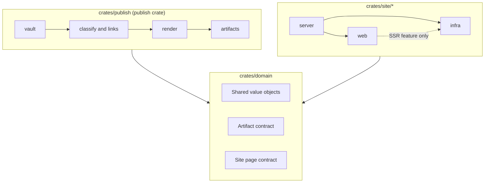
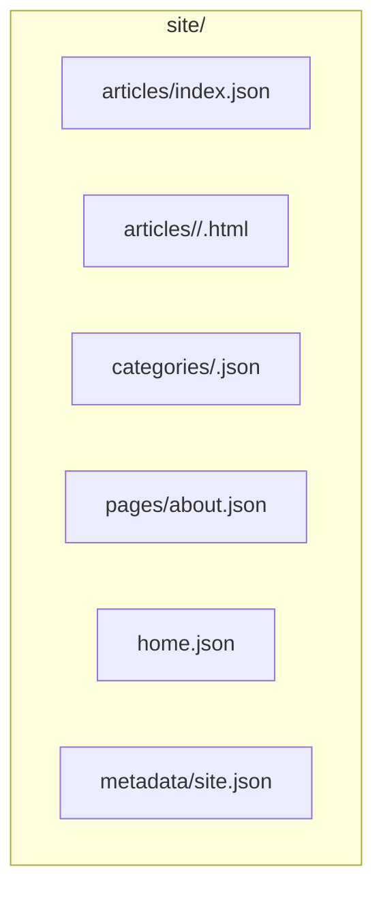
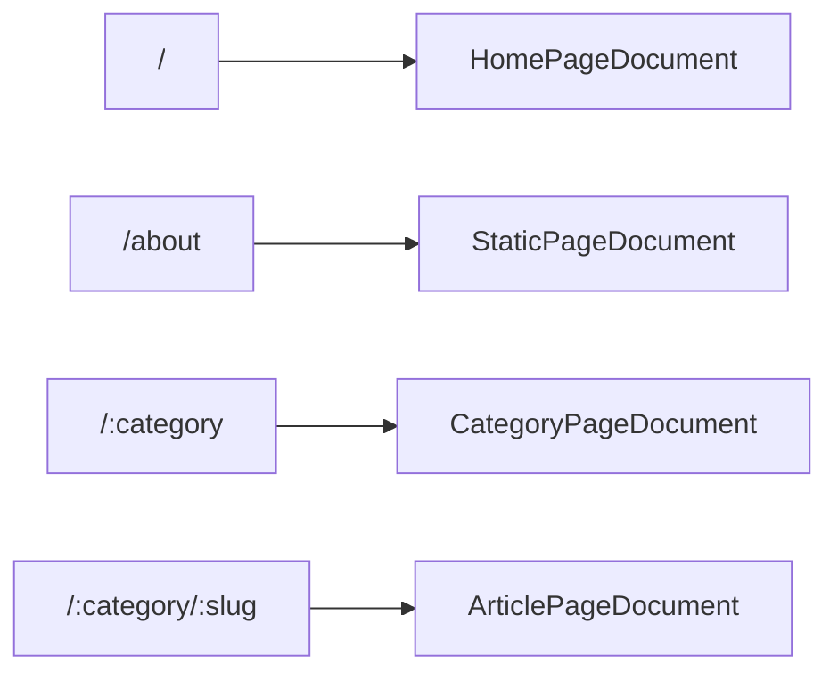

# okawak_blog アーキテクチャ

## 目的

`okawak_blog` は、Obsidian で書いた Markdown を公開成果物へ変換し、それを Topcoat SSR で配信するための静的コンテンツ公開基盤 + SSR 表示基盤である。

このリポジトリは一般的なブログ CMS ではない。主役は常駐 API サーバーではなく、`publish`による公開成果物生成パイプラインである。

## システム概要

公開フローは次の通り。

1. private な Obsidian リポジトリを git submodule として取得する
2. `crates/publish` の vault module が Markdown を走査し、frontmatter と本文を読み取る
3. classify module が公開種別を確定し、links module が公開URLの索引を構築する
4. render module が単一の`pulldown-cmark` event pipeline内でWikiLinkを解決・安全化し、MarkdownのHTML変換とbookmark enrichmentを行う
5. artifacts module が `site/` 配下の HTML / JSON を組み立てる
6. GitHub Actions が artifact を immutable release として S3 に配置し、`current.json` を最後に切り替える
7. `crates/site/server` が `crates/site/infra` 経由でrelease snapshotからpage documentを組み立て、`crates/site/web`がSSRする

Markdown から HTML への変換はビルド時に完了させる。ランタイムは artifact の読取、ルーティング、メタ情報の付与に集中する。


```mermaid
flowchart LR
    A[Private Obsidian Repo] --> B[git submodule]
    B --> C[vault module]
    C --> D[classify and links modules]
    D --> E[render module]
    E --> F[artifacts module]
    F --> G[site artifact directory]
    G --> H[GitHub Actions upload]
    H --> I[S3]
    I --> J[crates/site/infra]
    J --> K[crates/site/server]
    K --> L[crates/site/web SSR]
    L --> M[Browser]
```

## ワークスペース構成

```text
okawak_blog/
├── crates/
│   ├── domain/
│   ├── publish/
│   └── site/
│       ├── infra/
│       ├── server/
│       └── web/
├── e2e/
├── docs/
│   └── architecture/
├── service/
└── terraform/
```

各 crate の責務は次の通り。

- `crates/domain`
  - 公開コンテンツの純粋なdomain model・ルールと、`publish` / readerが共有する契約
  - `Category`、`Slug`、`PageKey`、`SectionPath`
  - `ArticleMeta`、`PublishableArticle`、`CategoryLandingMeta`、`PublishableCategoryLanding`と記事・カテゴリ索引を構築する純粋ルール
  - artifact contract
  - site page contract
- `crates/publish`
  - 単一の`publish` crate
  - `lib.rs`は内部module宣言とcrate外向けAPIのre-exportに限定し、pipeline moduleが公開処理全体をorchestrationする
  - crate外向けAPIはpublish entrypoint、bookmark enricher注入、`PublishError` / `Result`に限定する
  - path処理の対応環境はmacOSとLinuxとし、Windows形式のpathは対象外とする
  - vault moduleによるObsidian vault走査、Markdown読込、frontmatter parse
  - links moduleによる全公開contentのvault相対source keyと公開URLの索引構築、およびtable用にescapeされたpipeの正規化を含むWikiLink link / image eventの公開URL解決
  - render moduleによるcontent kindごとのdocument組み立てと共通本文処理
  - render/htmlによる入力Markdownを事前書換えしないWikiLinkと数式を含む`pulldown-cmark` event生成とHTML変換。数式spanには`.math-inline` / `.math-display`を使用する
  - render/sanitizeによるlink・image URLとraw HTMLの安全化
  - render/bookmarkによるsimple bookmark構文の判定、enrichmentの制御、rich bookmark HTML生成
  - render/ogpによる共有HTTP clientと上限付き並行処理を使ったbookmark metadata取得、OGP・Twitter Card・HTML fallbackの解析
  - classify moduleによる公開種別の確定と`section_path`の導出
  - artifacts moduleによるartifact構築、`site/`配下への書込み、生成結果のvalidation
  - `ObsidianFrontMatter`と`ContentKind`は`publish`入力形式として内部に保持する
  - `publish`固有のerrorはcrate rootの`PublishError`に集約し、内部module固有のerror moduleを作らない
- `crates/site/infra`
  - `ArtifactReader` 境界
  - local reader
  - S3 reader
- `crates/site/server`
  - production `topcoat-server` binaryによるTopcoat SSR、Topcoat runtime asset、client-side route遷移のホスト
  - reader の生成とTopcoat app / request contextへの注入
  - 互換用の記事一覧 API
  - process liveness (`/api/health`) と artifact readiness (`/api/ready`)
  - release-aware ETag と conditional GET
- `crates/site/web`
  - Topcoat UI component、公開route、metadata、site定数
  - client-side navigationと生成コンテンツ用script、Tailwind CSS入力、favicon asset
- `e2e`
  - `crates/site/server`と`crates/site/infra`をまたぐproduction Topcoat serverのbrowser E2E
  - 通常CIではprivate Obsidian submoduleやS3に依存しない固定artifact fixture
  - 実S3の検証は専用Playwright configを使い、ローカル手動確認とrelease公開前smoke testへ分離
  - Bunで依存を管理し、Playwright + Chromiumで公開route、metadata、client-side route遷移、Topcoat interactionを検証

`terraform/` は読み取り専用とし、このリポジトリの通常作業では編集しない。


```mermaid
flowchart TB
    subgraph Domain["crates/domain"]
        D1[Shared value objects]
        D2[Artifact contract]
        D3[Site page contract]
    end

    subgraph Publish["crates/publish (publish crate)"]
        P1[vault]
        P2[classify and links]
        P3[render]
        P4[artifacts]
    end

    subgraph Site["crates/site/*"]
        S1[infra]
        S2[server]
        S3[web]
    end

    Publish --> Domain
    Site --> Domain
    P1 --> P2
    P2 --> P3
    P3 --> P4
    S2 --> S1
    S2 --> S3
    S3 -. "SSR feature only" .-> S1
```

## コンテンツモデル

### frontmatter

`publish`が扱う Markdown は YAML frontmatter を持つ。役割判定には `kind` を使う。

採用している `kind` は次の 4 種類。

- `article`
  - 通常記事
  - `kind` 省略時の default
- `category`
  - カテゴリ landing page
- `page`
  - 固定ページ
- `home`
  - home 用 fragment

共通 frontmatter フィールド:

- `title`
- `kind`
- `summary`
- `is_completed`
- `priority`
- `created`
- `updated`
- `tags`

kind ごとの追加フィールド:

- `article`
  - `category`
- `category`
  - `category`
- `page`
  - `page`
- `home`
  - 追加フィールドなし

記事として扱う Markdown の例:

```yaml
---
title: "Rust Performance Notes"
kind: article
tags: ["rust", "performance"]
summary: "Short summary shown in lists and metadata."
is_completed: true
priority: 1
created: "2025-01-15T10:00:00+09:00"
updated: "2025-01-16T09:30:00+09:00"
category: "tech"
---
```

固定ページの例:

```yaml
---
title: "About"
kind: page
page: about
is_completed: true
created: "2025-01-15T10:00:00+09:00"
updated: "2025-01-16T09:30:00+09:00"
---
```

### ディレクトリ構造と `section_path`

article は frontmatter の `category` と同名のディレクトリ配下に置く。`publish`はこの一致を検証し、category 相対 path から `section_path` を導出する。

例:

```text
Publish/
  tech/
    landing.md
    rust/
      async/
        future.md
    web/
      leptos.md
```

この場合:

- `tech/landing.md`
  - `kind=category`
  - category landing page
- `tech/rust/async/future.md`
  - `kind=article`
  - `category=tech`
  - `section_path=["rust", "async"]`
- `tech/web/leptos.md`
  - `kind=article`
  - `category=tech`
  - `section_path=["web"]`

`section_path` は category page 上の grouped navigation に使う。Phase 3 では URL には含めない。
Rust内では順序付きの階層であることを`SectionPath`型で表し、artifact JSONでは従来どおり文字列配列として保存する。

Obsidian 側で実際に書く frontmatter とディレクトリ構造のテンプレートは [docs/content/obsidian-template.md](../content/obsidian-template.md) を参照する。

## Artifact 契約

`publish`は次の構造で `site/` を生成する。

```text
site/
├── articles/
│   ├── <category>/
│   │   └── <slug>.html
│   └── index.json
├── categories/
│   ├── <category>.json
│   └── ...
├── pages/
│   ├── about.json
│   └── ...
├── home.json
└── metadata/
    └── site.json
```

artifact の意味は次の通り。

- `articles/<category>/<slug>.html`
  - 記事本文 HTML
- `articles/index.json`
  - 全記事の一覧
- `categories/<category>.json`
  - そのカテゴリ配下の記事一覧とlanding page本文
  - title / description / updated_at / HTML本文を含む
  - 各記事に`section_path`を含む
  - 記事が存在するカテゴリでは landing Markdown を必須とする
  - frontmatterのtitleと本文を必須とし、空値を補完しない
- `pages/<page>.json`
  - 固定ページ
  - HTML 本文と title / description / updated_at を含む
- `home.json`
  - home pageへ実行時に組み込む任意のfragment
  - HTML 本文と title / description / updated_at を含む
- `metadata/site.json`
  - 総記事数とカテゴリ集計

`PageArtifactDocument` は固定ページを保持する。homeは完成したpageではなく実行時に記事一覧やmetadataと合成する一部分なので、`HomeFragmentArtifactDocument` として独立させる。

`publish`は描画済みカテゴリを`PublishableCategoryLanding`として組み立てる。frontmatterのtitleと描画済み本文はdomainの値オブジェクトで検証し、descriptionはArticleと同様に入力値を保持する。domainはlandingだけが存在するカテゴリも含めて`CategoryIndex`へ統合し、カテゴリ順、記事順、`SiteMetadata`の集計を確定する。artifact document単体のcategory、slug、title、timestamp、HTMLの不変条件もdomainで検証する。`publish` pipelineは記事が1件以上あり、必須のabout pageが存在することをartifact生成前に確認する。artifact builderはindexと描画済み本文を`CategoryArtifactDocument`へまとめ、writerはserializationとfilesystemへの書込みエラーを伝播する。Markdown変換、HTML生成、filesystemへの書込みは`publish`に残す。

### S3 release 契約

本番uploadは既存キーを上書きせず、次の構造へrelease単位で配置する。

```text
current.json
releases/
└── <release-id>/
    ├── manifest.json
    └── site/
        ├── articles/
        ├── categories/
        ├── pages/
        ├── home.json
        └── metadata/
```

`current.json`とreleaseごとの`manifest.json`は同じ`ArtifactReleasePointerDocument`を使い、schema version、release ID、artifact prefix、publisher commit、Obsidian source commit、RFC 3339 UTCの生成時刻を保持する。公開workflowは`main`からの`workflow_dispatch`だけで明示的に起動し、定期実行やローカルからの直接syncは標準経路にしない。repository単位のconcurrency groupと`queue: max`で公開runを直列化し、実行中runと待機中runをcancelしない。workflowは処理開始時にrunのcommitが最新`main`であり、同じcommitのpush起因CI workflowが成功済みであることを確認する。`site/`のuploadとobject数検証を終え、release prefixを直接読むbrowser E2Eが成功した後、runのpublisher commitがremote `main`の最新commitと一致することを再確認してから`current.json`を最後に更新する。古いrunはimmutable releaseを残して失敗し、公開pointerには触れない。これによりreaderは更新途中または表示検証に失敗したreleaseを公開対象として選ばず、待機runの処理順によって公開pointerが古いreleaseへ戻ることも防ぐ。


```mermaid
flowchart TB
    subgraph SiteArtifacts["site/"]
        A1["articles/index.json"]
        A2["articles/<category>/<slug>.html"]
        C1["categories/<category>.json"]
        P1["pages/about.json"]
        H1["home.json"]
        M1["metadata/site.json"]
    end
```

## 公開 URL

公開 URL は次の 4 系統。

- `/`
  - home
- `/about`
  - 固定ページ
- `/:category`
  - category landing page + article list
- `/:category/:slug`
  - article detail

`/articles/:slug` や `/categories/:category` は旧構造であり、現行の主要 route ではない。


```mermaid
flowchart LR
    H["/"] --> H1[HomePageDocument]
    A["/about"] --> A1[StaticPageDocument]
    C["/:category"] --> C1[CategoryPageDocument]
    R["/:category/:slug"] --> R1[ArticlePageDocument]
```

## Site 表示モデル

`crates/domain/src/site_page.rs` に、artifact から組み立てる pure な page contract を置く。

主な document は次の通り。

- `HomePageDocument`
  - 最近の記事一覧
  - カテゴリ集計
  - optional な `fragment`
- `HomeFragmentDocument`
  - home pageへ組み込むtitle、description、HTML、updated_at
- `ArticlePageDocument`
  - 記事メタデータ
  - 本文 HTML
- `CategoryPageDocument`
  - category landing HTML
  - 記事一覧
  - `section_path` ごとの grouped section
- `StaticPageDocument`
  - `about` などの固定ページ用contract

`site/web`のTopcoat pageはstorage非依存の`PageLoader`からこのpage contractを受け取り、metadataとUIを組み立てる。`site/server`は`ArtifactPageLoader`としてartifact読取とpage document構築を実装し、conditional GETが取得したsnapshotをrequest contextのloaderへ渡す。validatorを使わないrequestでもloader内でsnapshotを1回だけ取得する。local / S3 readerと`DynArtifactSnapshot`は`site/server`よりUI側へ持ち込まない。

公開routeのpage document読取はTopcoat async componentを正式経路とする。手書きの`/api/page/*`は持たず、404とstorage errorのstatus / error viewをroute境界で統一する。`/api/articles`はpage documentを組み立てない互換endpointとして維持する。

production `topcoat-server`はhome、about、category、articleをSSRし、title、canonical、Open Graph metadataと本文を同じsnapshotから初期HTMLへ組み立てる。

## UI styling境界

`site/web`のUIはTopcoat componentとTailwind CSSを主系にする。

- `src/topcoat_pages.rs`
  - Topcoat route / componentでsite chrome、page layout、responsive design、metadataを構成する
- `style/tailwind.css`
  - semantic color、radius、typography、site layout tokenとbase styleのsource of truth
- `style/content.css`
  - article、about、category landing、home fragmentの生成HTMLだけを`.content-prose`配下で整形するplain CSS
  - heading、code、table、image、bookmark、math spanとKaTeX描画結果など`publish` artifactの表現を担当する

productionは`style/tailwind.css`をTopcoatのstandalone Tailwind build integrationで生成し、Tailwind CSS、Topcoat runtime、site navigation JavaScript、faviconをTopcoat asset bundleからcontent-hash付きURLで配信する。生成コンテンツのKaTeXとhighlight.js、iconのFont Awesome、fontのNoto Sans JPはversion固定またはURL固定のCDN資産として維持し、KaTeXにはSRIを付与する。production build、fixture E2E、S3 smoke、`dev` / `dev-local`はNode / BunのCSS build toolを実行しない。Sass、Stylance、routeごとのCSS module生成工程は持たず、Rust componentのlayoutと、ビルド時に生成されるartifact本文のstyle境界を分離する。

## Reader 経路

artifact の読取は2段階の境界を経由する。

- `ArtifactReader`
  - 1処理で使う`ArtifactSnapshot`を取得する
- `ArtifactSnapshot`
  - article index、metadata、HTMLなどを同じreleaseから読む

- local reader
  - 自動test fixtureとreader単体test用
  - 開発サーバー用の`mise` taskでは利用しない
  - configured local rootをそのままsnapshotにする
  - file更新の即時反映を維持するためmemory cache decoratorを適用しない
- S3 reader
  - 本番配信とローカルからの本番相当確認に使うreader
  - `service/okawak_blog.service` 側の env で選択
  - `current.json`を読み、全artifact keyを同じrelease prefixへ固定する
  - release snapshotを短いTTLで再利用し、同一snapshot内のimmutable artifactをmemory cacheする
  - 同じartifactへのconcurrent missは1回のunderlying readへまとめ、load errorはcacheしない
  - 後方互換として`current.json`が存在しない場合だけ従来のbucket rootを読む

reader 側の設定は主に次の env で切り替える。

- `OKAWAK_BLOG_ARTIFACT_SOURCE`
  - `local` or `s3`
- `OKAWAK_BLOG_ARTIFACT_LOCAL_ROOT`
- `OKAWAK_BLOG_ARTIFACT_BUCKET`
- `OKAWAK_BLOG_ARTIFACT_PREFIX`
- `OKAWAK_BLOG_ARTIFACT_CACHE_TTL_SECONDS`
  - S3の`current.json`を再確認する間隔
  - defaultは5秒。`0`でcacheを無効化する

`OKAWAK_BLOG_SITE_ORIGIN` は canonical / Open Graph 用の absolute URL 生成に使う。

cacheはrelease snapshot単位で所有する。TTL経過後に`current.json`を再確認し、release identityが同じならartifact cacheを保持する。identityが変わった場合だけ新しいcacheへ切り替わり、既存requestが保持する古いsnapshotはそのrequestの完了まで有効である。legacy rootにはidentityを付けず、TTLごとにcacheを作り直す。

AWS SDK標準retry後もsnapshot更新に失敗した場合、cache identityを持つ直前のimmutable releaseをprocessの存続中は期限なく返す。fallback時も最終確認時刻を更新し、次のTTLまではS3への再試行を抑える。運用中に`current.json`が消えた場合もlegacy rootへdowngradeせず、直前のimmutable releaseを維持する。初回取得失敗、TTL=`0`、legacy snapshotにはfallbackしない。artifactは必要時にmemory cacheするため、stale snapshot内でも未取得objectのS3 readが失敗すればそのrequestはerrorになる。全artifactのeager preloadは行わない。

`site/server`はprocess instance、release snapshot identity、request URIからweak ETagを生成し、release生成時刻とprocess起動時刻の新しい方をHTTP-dateへ変換した`Last-Modified`を付与する。process起動時刻も含めることで、artifactが同じでもserver / UI更新後のrepresentationを日付validatorだけで再利用させない。対象はartifact-backedなGET / HEAD responseと`/api/articles`で、matching `If-None-Match`にはbodyをrenderせず`304 Not Modified`を返す。`If-Modified-Since`はresourceが存在することをhandlerの成功responseで確認してからbodyを破棄して304へ変換するため、未知のURIやerror responseを誤って304にしない。両方がある場合はRFC 9110に従って`If-None-Match`を優先し、不正または複数の`If-Modified-Since`は無視する。成功responseには`Cache-Control: public, max-age=0, must-revalidate`を付け、browserやproxyへ毎回のrevalidationを要求する。

validatorは`current.json`からimmutable release identityと生成時刻を取得でき、snapshot cache TTLが`0`でない場合だけ有効にする。local reader、legacy root、release prefixを直接読む公開前smoke test、TTL=`0`ではrequest内で同じsnapshotを保証できないため付与しない。health / readiness、static asset、404 / error responseも対象外とする。process再起動時はETagを変え、artifactが同じでもserver / UI変更後の古いrepresentationを再利用させない。stale fallback中は同じsnapshot metadataとprocess instanceを使うためvalidatorも維持する。

本番のAWS SDKは`AWS_CONFIG_FILE=/etc/okawak_blog/aws/config`のprofileから`aws_signing_helper credential-process`を実行し、IAM Roles AnywhereのX.509 identityを期限付きrole credentialへ交換する。helper、config、end-entity certificate、private keyはroot管理pathへ置き、`ProtectHome=true`を維持する。SDK標準のcredential refreshを使い、application独自のtimerやcredential管理責務を`site/infra`へ持ち込まない。

production runtimeはlong-livedなIAM user access key、Secrets Manager rotation、credential fileを持たない。`AWS_SHARED_CREDENTIALS_FILE`へfallbackせず、repositoryからstatic credential refresh timerも導入しない。IAM Roles Anywhere resourceと最小権限のS3 read roleをTerraformで管理し、certificate更新と障害確認は[AWS runtime認証runbook](../operations/aws-runtime-auth.md)に定める。

runtime probeは次のように分ける。

- `/api/health`
  - processがHTTP requestへ応答できることだけを確認するliveness
- `/api/ready`
  - configured `ArtifactReader`からsnapshotを取得し、site metadataを読めることを確認するreadiness
  - cache済みstale snapshotからmetadataを読める場合も配信可能として成功する

## ローカル開発と本番運用

ローカル開発は目的に応じてlocal artifactとS3 artifactを使い分ける。`publish`、artifact契約、UIを一続きで確認する場合は、private Obsidian submoduleからlocal artifactを生成する。

```text
Obsidian submodule
  -> mise run dev-local
  -> local publish process
  -> crates/publish/dist/site
  -> local reader
```

`dev-local`はprivate Obsidian submoduleに未commit差分がないことを確認してremoteの最新commitをcheckoutし、`publish`の通常の厳格モードとTopcoat asset bundle生成が成功した場合だけTopcoat serverを起動する。同期時にlocal merge commitは作らない。同期、`publish`、bundleのいずれかに失敗した場合はserverを起動しない。local readerにはmemory cacheを適用しないため、生成済みartifactの更新を即時に読める。ただし起動中にsource Markdownを変更した場合、`publish`の再実行は明示的に行う。

AWS認証、immutable release pointer、S3 cacheを含む本番相当のreader境界はS3用taskで確認する。

```text
GitHub Actions publish job
  -> S3 releases/<release-id>/site
  -> current.json pointer
  -> mise run dev / test-e2e-s3
```

`dev`と`test-e2e-s3`はAWS SDKのcredential chainと実S3 artifactを使う。bucket、任意prefix、credentialは実行時envとローカルAWS設定から受け取り、repositoryには保存しない。固定fixtureを使う`test-e2e`は、開発環境の表示確認ではなく、pull requestとmain pushで外部状態に依存せず実行するCI回帰テストとして維持する。upload workflowは`main`から手動実行し、OIDCの一時credentialを使ってimmutable release prefixを`test-e2e-s3`で検証した後だけ公開pointerを切り替える。

本番では GitHub Actions が artifact を S3 に置き、VPS 上の単一バイナリがそれを読む。

```text
Obsidian submodule
  -> GitHub Actions publish job
  -> S3 releases/<release-id>/site
  -> current.json pointer switch
  -> okawak_blog.service (127.0.0.1:8008)
  -> cloudflared.service
  -> Cloudflare Tunnel
  -> Browser
```

application deployはTopcoat release binaryとasset bundleを同じrelease単位で扱う。`build-deployment`は稼働中のdirectoryへ書かず、`target/release/topcoat-server`と`target/assets-staged`を生成する。activationはservice停止中にbinaryを`bin/okawak_blog`、bundleをbinary隣接の`bin/assets`へ切り替える。stagingはmanifest内のCSS、JavaScript、faviconと各参照fileを検証し、WebAssemblyを拒否する。起動後のhealth / readinessが失敗した場合は旧binaryと旧bundleを復元し、失敗bundleを`bin/assets.failed`へ保存する。

`cloudflared`はVPSからCloudflareへ外向き接続し、originの80/443は公開しない。public hostnameとTunnel routeはCloudflare Dashboardで管理し、OCI TerraformはReserved Public IP、SSH用ingress、Tunnel用egressなどのOCI resourceだけを管理する。S3 upload は Rust アプリに持たせず、workflow の責務として扱う。

## 非目標

現時点の非目標は次の通り。

- DB ベースの記事管理
- ユーザー認証・認可
- 管理画面
- ブラウザ UI からの記事作成・編集
- マルチユーザー機能
- SaaS 的 CMS 機能
- リアルタイム更新

検索、multiple bucket / prefix、full HTML snapshot、キャッシュ戦略の追加拡張は別 Issue で扱う。
