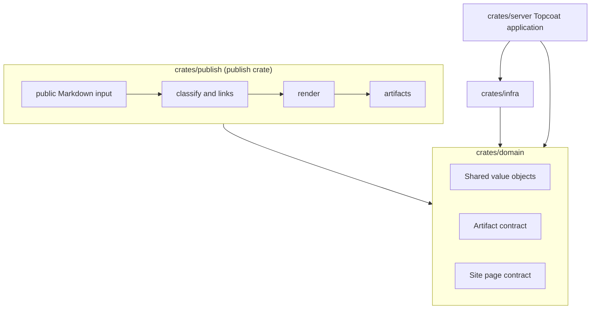
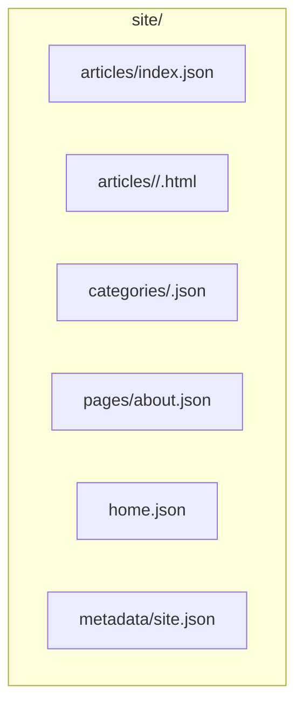
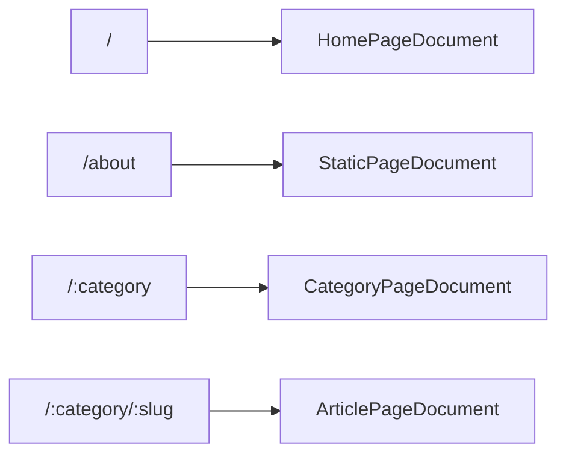

# okawak_blog アーキテクチャ

## 目的

`okawak_blog` は、Obsidian で書いた Markdown を公開成果物へ変換し、それを Topcoat SSR で配信するための静的コンテンツ公開基盤 + SSR 表示基盤である。

このリポジトリは一般的なブログ CMS ではない。主役は常駐 API サーバーではなく、`publish`による公開成果物生成パイプラインである。

## システム概要

公開フローは次の通り。

1. ローカルの`export`がprivate Obsidianから公開対象を抽出する
2. 公開参照を正規化し、必要な文章だけ翻訳して日英MarkdownをGit管理する
3. `publish`が`content/ja`と`content/en`のversion付きMarkdownを検証する
4. 公開IDの参照を言語別URLへ解決し、HTML変換・安全化・bookmark enrichmentを行う
5. 日英artifactと配信可能な言語の索引を`site/`へ生成する
6. GitHub Actionsがimmutable releaseとしてS3に配置し、`current.json`を最後に切り替える
7. serverがinfra経由でartifact snapshotを読み、TopcoatでSSRする

Markdown から HTML への変換はビルド時に完了させる。ランタイムは artifact の読取、ルーティング、メタ情報の付与に集中する。


```mermaid
flowchart LR
    A[Private Obsidian Repo] --> B[git submodule]
    B --> E1[local export and translation]
    E1 --> E2[public Markdown in Git]
    E2 --> C[publish input]
    C --> D[classify and links modules]
    D --> E[render module]
    E --> F[artifacts module]
    F --> G[site artifact directory]
    G --> H[GitHub Actions upload]
    H --> I[S3]
    I --> J[crates/infra]
    J --> K[crates/server Topcoat application]
    K --> M[Browser]
```

## ワークスペース構成

```text
okawak_blog/
├── crates/
│   ├── domain/
│   ├── export/
│   ├── publish/
│   ├── infra/
│   └── server/
├── e2e/
├── docs/
│   └── architecture/
├── scripts/
│   └── tests/
├── service/
│   └── tests/
└── terraform/
```

各crateは`crates/`直下へ並べ、workspace memberは各パスを明示する。配信用の親ディレクトリを設けず、責務と依存方向はcrate境界で表す。

各 crate の責務は次の通り。

- `crates/export`
  - ローカルの公開対象抽出、public Markdownの参照正規化、stable IDと翻訳履歴の管理
  - `translation`による記事・辞書で共有できる翻訳requestと更新判定、`fragments`によるMarkdown文章の抽出・再構築
  - 記事・タグ・UI共通のモデル・翻訳指示・用語集は、リポジトリルートの`translation.json`で管理する
  - CLIは`clap`でpath指定と候補の採用対象を型として表す。通常実行は抽出・差分翻訳・更新候補生成を自動で行い、`accept article|tag|ui`による採用だけを明示操作にする
  - `codex`によるChatGPT認証のローカル実行境界。AIへvaultを渡さず、public文章だけの作業領域と読取権限へ限定する
  - `sync`による出力全体のstaging・入替・中断時の復旧境界。uploadは行わない

- `crates/domain`
  - 公開コンテンツの純粋なdomain model・ルールと、`publish` / readerが共有する契約
  - `lib.rs`を明示的な公開APIのfacadeとし、内部moduleをcrate外の契約にしない。`unreachable_pub`で不要な公開を検出する
  - `Category`、`Slug`、`PageKey`、`SectionPath`
  - `content` moduleによる`Locale`とversion付き`PublicContentMeta`。公開Markdownの純粋な検証契約を所有する（[契約](../content/public-markdown.md)）。
  - `publication` moduleによる`ArticleMeta`、`PublishableArticle`、`CategoryLandingMeta`、`PublishableCategoryLanding`と記事・カテゴリ索引を構築する純粋ルール
  - `artifact` moduleによるartifact contract。`artifact/content.rs`にsite content document、`artifact/release.rs`にimmutable release pointerとその検証を置く
  - `page` moduleによる公開ページ契約。言語非依存のdocument、artifactからの組み立て、公開pathの生成を所有する
- `crates/publish`
  - 単一の`publish` crate
  - `lib.rs`は内部module宣言とcrate外向けAPIのre-exportに限定し、pipeline moduleが公開処理全体をorchestrationする
  - crate外向けAPIはpublish entrypoint、bookmark enricher注入、`PublishError` / `Result`に限定する
  - path処理の対応環境はmacOSとLinuxとし、Windows形式のpathは対象外とする
  - input moduleによる公開Markdownの読込、frontmatter・言語・ID対応の検証。private入力と公開判定はexportの責務
  - links moduleによる安定したcontent IDのURL解決。英語版があれば英語URL、なければ日本語URLへリンクする。未解決IDと未正規化WikiLinkは失敗させる
  - render moduleによるcontent kindごとのdocument組み立てと共通本文処理
  - render/htmlによる入力Markdownを事前書換えしない公開リンクと数式を含む`pulldown-cmark` event生成とHTML変換。数式spanには`.math-inline` / `.math-display`を使用する
  - render/sanitizeによるlink・image URLとraw HTMLの安全化
  - render/bookmarkによるsimple bookmark構文の判定、enrichmentの制御、rich bookmark HTML生成
  - render/ogpによる共有HTTP clientと上限付き並行処理を使ったbookmark metadata取得、OGP・Twitter Card・HTML fallbackの解析
  - classify moduleによる公開種別の確定と`section_path`の導出
  - artifacts moduleによるartifact構築、`site/`配下への書込み、生成結果のvalidation
  - CLIの`--validate-artifacts`は`artifact_check`でdomainのpage builderを使い、公開前に全言語のhome・記事・カテゴリ・固定ページの不変条件を検証する。公開前scriptはこれに加えてartifact間の集合・件数を照合する。
  - `PublicContentMeta`と`ContentKind`はdomainの共有契約。Obsidian固有frontmatterを保持しない
  - `publish`固有のerrorはcrate rootの`PublishError`に集約し、内部module固有のerror moduleを作らない
- `crates/infra`
  - 公開Markdown抽出には関与しない。
  - `contract` moduleによる`ArtifactReader` / `ArtifactSnapshot`境界
  - `local` moduleによるfilesystem reader
  - `s3` moduleによるS3 readerとimmutable release解決
  - `cache` moduleによるsnapshot / artifact cache
  - `config` moduleによるsource設定とreader composition
  - `error` moduleによるstorage / config error境界
  - `lib.rs`はmodule宣言とcrate外向けAPIのre-exportに限定する
- `crates/server`
  - production `server` binaryを持つ単一のTopcoat application crate
  - Topcoat UI component、公開route、metadata、site定数
  - 生成コンテンツ用script、Tailwind CSS入力、favicon asset
  - Topcoat SSR、Topcoat runtime asset、ブラウザ標準のfull-page navigation
  - reader の生成とTopcoat app / request contextへの注入
  - `app.rs`をrootにした`module_router!()`のmodule-derived route tree
  - `app/api` moduleによる互換記事一覧API、process liveness、artifact readiness
  - `app` moduleによるglobal layer / app context / assetのcomposition
  - `page_loader` moduleによるstorage非依存page load contract
  - `artifact_page_loader` moduleによるartifact readerとpage load contractの接続
  - UI moduleは`infra`を直接利用せず、`PageLoaderContext`を経由する
  - `http_cache` moduleによるrelease-aware ETagとconditional GET
  - `tests/router.rs`による公開routerのcrate外integration test
- `e2e`
  - `crates/server`と`crates/infra`をまたぐproduction Topcoat serverのbrowser E2E
  - 通常CIではprivate Obsidian submoduleやS3に依存しない固定artifact fixture
  - 実S3の検証は専用Playwright configを使い、ローカル手動確認とrelease公開前smoke testへ分離
  - Bunで依存を管理し、Playwright + Chromiumで公開route、metadata、full-page navigation、Topcoat interactionを検証

`scripts/tests/`はデプロイ・証明書更新などの運用スクリプトを検証し、`service/tests/`はsystemd unitの設定を検証する。`mise run test-service`が両方を実行する。

`terraform/` は読み取り専用とし、このリポジトリの通常作業では編集しない。


```mermaid
flowchart TB
    subgraph Domain["crates/domain"]
        D1[Shared value objects]
        D2[Artifact contract]
        D3[Site page contract]
    end

    subgraph Publish["crates/publish (publish crate)"]
        P1[public Markdown input]
        P2[classify and links]
        P3[render]
        P4[artifacts]
    end

    S1[crates/infra]
    S2[crates/server Topcoat application]

    Publish --> Domain
    S1 --> Domain
    S2 --> Domain
    P1 --> P2
    P2 --> P3
    P3 --> P4
    S2 --> S1
```

## コンテンツモデル

### frontmatter

`export`が読み取るObsidian MarkdownはYAML frontmatterを持つ。以下は執筆用のprivate入力形式であり、publishへは[公開Markdown契約](../content/public-markdown.md)に正規化して渡す。役割判定には`kind`を使う。

採用している `kind` は次の 4 種類。

- `article`
  - 通常記事
  - `kind` 省略時の default
- `category`
  - カテゴリ landing page
- `page`
  - 固定ページ
- `home`
  - home 用 fragment

共通 frontmatter フィールド:

- `title`
- `kind`
- `summary`
- `is_completed`
- `priority`
- `created`
- `updated`
- `tags`

kind ごとの追加フィールド:

- `article`
  - `category`
- `category`
  - `category`
- `page`
  - `page`
- `home`
  - 追加フィールドなし

記事として扱う Markdown の例:

```yaml
---
title: "Rust Performance Notes"
kind: article
tags: ["rust", "performance"]
summary: "Short summary shown in lists and metadata."
is_completed: true
priority: 1
created: "2025-01-15T10:00:00+09:00"
updated: "2025-01-16T09:30:00+09:00"
category: "tech"
---
```

固定ページの例:

```yaml
---
title: "About"
kind: page
page: about
is_completed: true
created: "2025-01-15T10:00:00+09:00"
updated: "2025-01-16T09:30:00+09:00"
---
```

### ディレクトリ構造と `section_path`

article は frontmatter の `category` と同名のディレクトリ配下に置く。`export`はこの一致を検証し、category 相対 path から `section_path` を導出する。

例:

```text
Publish/
  tech/
    landing.md
    rust/
      async/
        future.md
    web/
      topcoat.md
```

この場合:

- `tech/landing.md`
  - `kind=category`
  - category landing page
- `tech/rust/async/future.md`
  - `kind=article`
  - `category=tech`
  - `section_path=["rust", "async"]`
- `tech/web/topcoat.md`
  - `kind=article`
  - `category=tech`
  - `section_path=["web"]`

`section_path` は category page 上の grouped navigation に使う。Phase 3 では URL には含めない。
Rust内では順序付きの階層であることを`SectionPath`型で表し、artifact JSONでは従来どおり文字列配列として保存する。

Obsidian 側で実際に書く frontmatter とディレクトリ構造のテンプレートは [docs/content/obsidian-template.md](../content/obsidian-template.md) を参照する。

## Artifact 契約

`publish`は次の構造で `site/` を生成する。

```text
site/
├── articles/
│   ├── <category>/
│   │   └── <slug>.html
│   └── index.json
├── categories/
│   ├── <category>.json
│   └── ...
├── pages/
│   ├── about.json
│   └── ...
├── home.json
└── metadata/
    └── site.json
```

artifact の意味は次の通り。

- `articles/<category>/<slug>.html`
  - 記事本文 HTML
- `articles/index.json`
  - 全記事の一覧
- `categories/<category>.json`
  - そのカテゴリ配下の記事一覧とlanding page本文
  - title / description / updated_at / HTML本文を含む
  - 各記事に`section_path`を含む
  - 記事が存在するカテゴリでは landing Markdown を必須とする
  - frontmatterのtitleと本文を必須とし、空値を補完しない
- `pages/<page>.json`
  - 固定ページ
  - HTML 本文と title / description / updated_at を含む
- `home.json`
  - home pageへ実行時に組み込む任意のfragment
  - HTML 本文と title / description / updated_at を含む
- `metadata/site.json`
  - 総記事数とカテゴリ集計

`PageArtifactDocument` は固定ページを保持する。homeは完成したpageではなく実行時に記事一覧やmetadataと合成する一部分なので、`HomeFragmentArtifactDocument` として独立させる。

`publish`は描画済みカテゴリを`PublishableCategoryLanding`として組み立てる。frontmatterのtitleと描画済み本文はdomainの値オブジェクトで検証し、descriptionはArticleと同様に入力値を保持する。domainはlandingだけが存在するカテゴリも含めて`CategoryIndex`へ統合し、カテゴリ順、記事順、`SiteMetadata`の集計を確定する。artifact document単体のcategory、slug、title、timestamp、HTMLの不変条件もdomainで検証する。`publish` pipelineは記事が1件以上あり、必須のabout pageが存在することをartifact生成前に確認する。artifact builderはindexと描画済み本文を`CategoryArtifactDocument`へまとめ、writerはserializationとfilesystemへの書込みエラーを伝播する。Markdown変換、HTML生成、filesystemへの書込みは`publish`に残す。

### 言語別artifact

日本語の既存keyは維持し、英語は同じ構造を`site/en/`へ置く。集計は各言語で表示する記事の件数とし、日英を合算しない。日本語は記事1件以上・About・記事カテゴリのlandingを必須とする。英語は翻訳履歴があり更新待ちでないcontentだけを採用し、landingが未翻訳のカテゴリの記事を掲載しない。英語のAboutは存在するときだけ配信対象にする。

`site/locales.json`の`SiteLocalesDocument`は同じreleaseで配信可能なpathとlocaleの対応を持つ。参照画像だけを`site/content-assets/`へコピーする。buildは一時領域で全言語を検証してからsiteを入れ替え、古いHTMLを残さない。

### S3 release 契約

本番uploadは既存キーを上書きせず、次の構造へrelease単位で配置する。

```text
current.json
releases/
└── <release-id>/
    ├── manifest.json
    └── site/
        ├── articles/
        ├── categories/
        ├── pages/
        ├── home.json
        └── metadata/
```

`current.json`とreleaseごとの`manifest.json`は同じ`ArtifactReleasePointerDocument`を使い、schema version、release ID、artifact prefix、publisher commit、source commit、任意のcontent commit、RFC 3339 UTCの生成時刻を保持する。schema v1を維持し、`content_commit`は後方互換の任意フィールドとする。旧releaseでは`source_commit`がprivate vaultのrevision、新releaseでは互換用に公開repositoryのrevisionを保持し、`content_commit`も同じ公開commitを明示する。新旧readerは日本語artifact配置を共有し、新readerは`content_commit`のない旧pointerも読める。公開workflowは`main`からの`workflow_dispatch`だけで明示的に起動し、定期実行やローカルからの直接syncは標準経路にしない。repository単位のconcurrency groupと`queue: max`で公開runを直列化し、実行中runと待機中runをcancelしない。workflowは処理開始時にrunのcommitが最新`main`であり、同じcommitのpush起因CI workflowが成功済みであることを確認する。公開workflowはprivate submoduleとAI認証を使わず、checkout済み`content/`を入力にする。`scripts/validate_public_artifacts.sh`で日英のindex・metadata・宣言された全artifactの存在を検証する。`site/`のupload後に全object数・HTML数と`locales.json`の一致を確認し、release prefixを直接読むbrowser E2Eで各言語のhome・存在するAbout・代表カテゴリと記事を検証する。成功した後、runのpublisher commitがremote `main`の最新commitと一致することを再確認してから`current.json`を最後に更新する。古いrunはimmutable releaseを残して失敗し、公開pointerには触れない。これによりreaderは更新途中または表示検証に失敗したreleaseを公開対象として選ばず、待機runの処理順によって公開pointerが古いreleaseへ戻ることも防ぐ。


```mermaid
flowchart TB
    subgraph SiteArtifacts["site/"]
        A1["articles/index.json"]
        A2["articles/<category>/<slug>.html"]
        C1["categories/<category>.json"]
        P1["pages/about.json"]
        H1["home.json"]
        M1["metadata/site.json"]
    end
```

## 公開 URL

公開 URL は次の 4 系統。

- `/`
  - home
- `/about`
  - 固定ページ
- `/:category`
  - category landing page + article list
- `/:category/:slug`
  - article detail

`/articles/:slug` や `/categories/:category` は旧構造であり、現行の主要 route ではない。


```mermaid
flowchart LR
    H["/"] --> H1[HomePageDocument]
    A["/about"] --> A1[StaticPageDocument]
    C["/:category"] --> C1[CategoryPageDocument]
    R["/:category/:slug"] --> R1[ArticlePageDocument]
```

## Site 表示モデル

`crates/domain/src/page.rs`に言語非依存のdocumentを置き、`page/builder.rs`でartifactからの組み立て、`page/path.rs`で公開pathを扱う。カテゴリとタグは識別子を保ち、`Category::display_name()`や固定の表示名を持たない。表示metadataは`crates/server/src/metadata.rs`がUI辞書で組み立てる。

主な document は次の通り。

- `HomePageDocument`
  - 最近の記事一覧
  - カテゴリ集計
  - optional な `fragment`
- `HomeFragmentDocument`
  - home pageへ組み込むtitle、description、HTML、updated_at
- `ArticlePageDocument`
  - 記事メタデータ
  - 本文 HTML
- `CategoryPageDocument`
  - category landing HTML
  - 記事一覧
  - `section_path` ごとの grouped section
- `StaticPageDocument`
  - `about` などの固定ページ用contract

`crates/server`のTopcoat pageはstorage非依存の`PageLoader`からこのpage contractと同じreleaseのタグ表示名・言語別URL一覧を`Presentation<T>`として受け取り、metadataとUIを組み立てる。同じcrate内の`ArtifactPageLoader`だけがartifact読取とpage document構築を実装し、conditional GETが取得したsnapshotをrequest contextのloaderへ渡す。validatorを使わないrequestでもloader内でsnapshotを1回だけ取得する。local / S3 readerと`DynArtifactSnapshot`をpage / component moduleへ持ち込まない。

homeのarticle index、site metadata、optional home fragmentは、同じsnapshotから並列に読む。home fragmentの不在だけを省略可能として扱い、それ以外の読取失敗はpageの500応答へ伝える。必要な読取とpage document構築を終えてから初期HTMLとHTTP statusを確定する。

公開routeのpage document読取はTopcoat async componentを正式経路とする。手書きの`/api/page/*`は持たず、404とstorage errorのstatus / error viewをroute境界で統一する。`/api/articles`はpage documentを組み立てない互換endpointとして維持する。

公開routeは`crates/server/src/app.rs`をrootとするTopcoat `module_router!()`から登録する。`/about`と`/api/*`はstatic module、`/{category_name}`と`/{category_name}/{article_slug}`は`path_param!()`を宣言するnested moduleとしてURL構造へ対応させる。英語routeは`app/en.rs`以下の同型のfile moduleで構成し、page種別ごとの描画処理を共有する。日本語URLを維持し、英語homeは`/en`、他は`/en/...`とする。`/en/`は既存の末尾slash規則に従い`/en`へredirectする。画像は`app/content_assets/asset_name.rs`から`PageLoader`経由で読み、`/content-assets/<hash>.<ext>`で言語共通に配信する。route moduleはfile moduleで構成し、`mod.rs`を使わない。release-aware conditional GETはmodule pathに依存しないglobal layerとして`app.rs`で明示的に登録する。

routerはTopcoat 0.8.1の`.runtime()`と`.discover_shards()`を登録し、`TrailingSlash::Redirect`で末尾スラッシュを宣言済みURLへ308リダイレクトする。queryは維持し、redirectにはartifact validatorを付けない。`/_topcoat`配下のframework endpointをサイト用404 HTMLの対象から除外する。

conditional GETのmethod判定には`request::original_method(cx)`を使う。runtimeのpage再描画はPOSTを内部でGETへrewriteするため、rewrite後のmethodで判定するとsignal状態に依存するHTMLへ通常pageと同じvalidatorを付けてしまう。元のrequestがPOSTならartifact cacheの対象にしない。

カテゴリ内の記事絞り込みは`src/category_articles.rs`のshardが所有する。shard内のsignalをサーバー側で読み、記事一覧と入力欄だけをDOM morphで更新する。UI用の純粋な部分一致ロジックは`src/article_filter.rs`に置き、タイトル・説明・表示中のタグ名を対象にする。ブラウザから届くカテゴリと言語はdomain型へ検証し、検索語は先頭100文字に制限する。初期pageとshardはリクエスト単位の`#[memoize]`でカテゴリと言語をkeyに同じpage documentを共有し、再描画時もstorageへ直接依存せず`PageLoader`を使う。sectionと記事に安定したIDを付け、入力フォーカスとshard外のmenu・生成本文を維持する。JavaScript無効時は全記事をSSRした一覧を利用できる。

production `server`はhome、about、category、articleをSSRし、title、canonical、hreflang、html lang、Open Graph metadataと本文を同じsnapshotから初期HTMLへ組み立てる。hreflangは`locales.json`に掲載された同じページの実在する翻訳だけを示す。英語artifactがなければ英語の404を返し、日本語本文を英訳として配信しない。UI辞書の欠落・更新待ちは日本語、キー自体の欠落はキー文字列へfallbackしてログに記録する。CIでは型付きキーの全件存在、英訳の欠落・更新待ち、補間変数を検証する。

## UI styling境界

`crates/server`のUIはTopcoat componentとTailwind CSSを主系にする。

- `src/page_loader.rs`
  - storage非依存のpage load portを定義する
- `src/app.rs`
  - `module_router!()`のroot、home page、page loader context取得、application compositionを構成する
- `src/app/about.rs`、`src/app/category_name.rs`、`src/app/category_name/article_slug.rs`
  - module-derived pathとpage種別ごとの固有componentを構成する
- `src/app/api.rs`、`src/app/api/*.rs`
  - URL構造に対応するAPI route treeを構成する
- `src/article_card.rs`
  - listing route間で共有する記事cardを構成する
- `src/shell.rs`
  - site chrome、metadata、error view、responsive navigationと、生成contentのKaTeX / highlight.js progressive enhancementをshell resourceとして構成する
- `src/assets.rs`
  - application所有のstylesheetとfavicon assetを登録する
- `src/icons.rs`
  - 同梱したGitHub Octiconsの単一SVGをTopcoatのicon componentへ渡す。icon fontや外部icon setの取得を必要としない
- `style/tailwind.css`
  - semantic color、radius、typography、site layout tokenとbase styleのsource of truth
- `style/content.css`
  - article、about、category landing、home fragmentの生成HTMLだけを`.content-prose`配下で整形するplain CSS
  - heading、code、table、image、bookmark、math spanとKaTeX描画結果など`publish` artifactの表現を担当する

productionは`style/tailwind.css`をTopcoatのstandalone Tailwind build integrationで生成し、Tailwind CSS、Topcoat runtime、faviconをTopcoat asset bundleからcontent-hash付きURLで配信する。公開linkは独自client routerを持たず、ブラウザ標準のfull-page navigationを使う。mobile menuはTopcoat runtimeのsignalとevent expressionで構成する。GitHubアイコンはTopcoatのicon componentによるinline SVGとし、リンクのaccessible nameを維持してSVG自体は支援技術から隠す。端末間の字体を揃えるNoto Sans JPはGoogle Fontsの可変ウェイト範囲`400..700`を指定し、ウェイトごとのCSS宣言の重複を抑える。font stylesheetはshellのHTML headから直接読み込み、`display=swap`で読み込み中の本文表示を維持する。生成コンテンツのKaTeXとhighlight.jsはversion固定のCDN資産として維持し、KaTeXにはSRIを付与する。production build、fixture E2E、S3 smoke、`dev` / `dev-local`はNode / BunのCSS build toolを実行しない。Sass、Stylance、routeごとのCSS module生成工程は持たず、Rust componentのlayoutと、ビルド時に生成されるartifact本文のstyle境界を分離する。

`crates/server/build.rs`はapplication package内の`style/tailwind.css`をTopcoatのstylesheet assetへ変換するために維持する。Rustと`view!` macroの書式はrepository rootの`mise run format`から`cargo fmt`と`topcoat fmt`を順に適用する。

shellのナビゲーションは言語別pathをリンク先に使い、request URIのpathと比較して現在位置を示す。queryは比較に含めず、404でも実際のURLに基づく選択状態を維持する。mobile menuの開閉文言も選択中の辞書からclient expressionへ渡す。言語名は日本語 / Englishの自称表記で示す。

`server/src/language.rs`が初期言語選択と上部の言語切替componentを所有する。GET / HEADの`/`では保存済み`okawak_locale` cookie、`Accept-Language`の対応言語の優先度、英語の順に選び、英語homeが公開済みなら307で`/en`へ案内する。日本語の本文は引き続き`/`、英語の本文は`/en`で配信し、記事や固定ページの直接URLをブラウザ設定で変更しない。rootの日本語応答・304は`Vary: Accept-Language, Cookie`と`Cache-Control: private, no-cache`を持つ。

上部の切替は正規pathに`?lang=ja|en`を付けた通常リンクで、mobile menuを開かずに操作できる。選択先は同じページの翻訳、対象言語のhomeの順で決め、homeも未公開なら無効表示にする。serverは選択をhost限定・Path=/・HttpOnly・SameSite=Lax・1年有効のcookieへ保存し、選択用queryを除いた公開URLへ303で移す。自動判定・選択保存のredirectは`no-store`で共有cacheしない。日本語homeのナビゲーションにも明示選択を付け、英語ブラウザで日本語記事を読んでいる場合も日本語homeへ戻れる。hreflangは引き続き同じページの実在する翻訳だけを示す。

初期言語判定はconditional GETの304判定より先に行い、`PageLoader::load_locales`と本文描画に同じartifact snapshotを渡す。API・画像・Topcoat内部route・POSTによる再描画には適用しない。ブラウザの言語・cookieに関する処理はserver内に閉じ、domain・publish・infraへ依存を増やさない。

## Reader 経路

artifact の読取は2段階の境界を経由する。

- `ArtifactReader`
  - 1処理で使う`ArtifactSnapshot`を取得する
- `ArtifactSnapshot`
  - article index、metadata、HTMLなどを同じreleaseから読む

- local reader
  - 自動test fixtureとreader単体test用
  - 開発サーバー用の`mise` taskでは利用しない
  - configured local rootをそのままsnapshotにする
  - file更新の即時反映を維持するためmemory cache decoratorを適用しない
- S3 reader
  - 本番配信とローカルからの本番相当確認に使うreader
  - `service/okawak_blog.service` 側の env で選択
  - `current.json`を読み、全artifact keyを同じrelease prefixへ固定する
  - release snapshotを短いTTLで再利用し、同一snapshot内のimmutable artifactをmemory cacheする
  - 同じartifactへのconcurrent missは1回のunderlying readへまとめ、load errorはcacheしない
  - 後方互換として`current.json`が存在しない場合だけ従来のbucket rootを読む

reader 側の設定は主に次の env で切り替える。

- `OKAWAK_BLOG_ARTIFACT_SOURCE`
  - `local` or `s3`
- `OKAWAK_BLOG_ARTIFACT_LOCAL_ROOT`
- `OKAWAK_BLOG_ARTIFACT_BUCKET`
- `OKAWAK_BLOG_ARTIFACT_PREFIX`
- `OKAWAK_BLOG_ARTIFACT_CACHE_TTL_SECONDS`
  - S3の`current.json`を再確認する間隔
  - defaultは5秒。`0`でcacheを無効化する

`OKAWAK_BLOG_SITE_ORIGIN` は canonical / Open Graph 用の absolute URL 生成に使う。

production `server`はprocess起動時に`tracing` subscriberを初期化する。log filterは`RUST_LOG`からlossyに読み、未指定または有効なdirectiveがない場合は`info`を使う。同じapplication crateのpage handlerはpage document読取失敗を構造化eventとして発行する。subscriber設定は`crates/server`のbinary entrypointに閉じ、domain、publish、infraはprocess-wideなlog設定を所有しない。

cacheはrelease snapshot単位で所有する。TTL経過後に`current.json`を再確認し、release identityが同じならartifact cacheを保持する。identityが変わった場合だけ新しいcacheへ切り替わり、既存requestが保持する古いsnapshotはそのrequestの完了まで有効である。legacy rootにはidentityを付けず、TTLごとにcacheを作り直す。

タグ表示名も同じreleaseの言語別`tags.json`から読み、言語別cacheに保持する。記事内のタグIDは変換しない。UI文言の原文・用途・英訳は`crates/server/locales/ui.json`で管理し、記事・タグと同じexportの差分翻訳処理を利用する。

言語別snapshotは同じrelease locationを共有し、artifact keyだけを日本語の既存path / 英語の`en/`へ切り替える。cacheは言語ごとに分離する。rootの`locales.json`が存在しない旧releaseは日本語のみとして扱い、存在するが壊れている場合はerrorにする。画像は言語共通の`content-assets/`からbytesで読み、公開用のhash filenameを`ContentAssetName`で検証する。

AWS SDK標準retry後もsnapshot更新に失敗した場合、cache identityを持つ直前のimmutable releaseをprocessの存続中は期限なく返す。fallback時も最終確認時刻を更新し、次のTTLまではS3への再試行を抑える。運用中に`current.json`が消えた場合もlegacy rootへdowngradeせず、直前のimmutable releaseを維持する。初回取得失敗、TTL=`0`、legacy snapshotにはfallbackしない。artifactは必要時にmemory cacheするため、stale snapshot内でも未取得objectのS3 readが失敗すればそのrequestはerrorになる。全artifactのeager preloadは行わない。

`crates/server`はprocess instance、release snapshot identity、request URIからweak ETagを生成し、release生成時刻とprocess起動時刻の新しい方をHTTP-dateへ変換した`Last-Modified`を付与する。process起動時刻も含めることで、artifactが同じでもserver / UI更新後のrepresentationを日付validatorだけで再利用させない。対象はartifact-backedなGET / HEAD responseと`/api/articles`で、matching `If-None-Match`にはbodyをrenderせず`304 Not Modified`を返す。`If-Modified-Since`はresourceが存在することをhandlerの成功responseで確認してからbodyを破棄して304へ変換するため、未知のURIやerror responseを誤って304にしない。両方がある場合はRFC 9110に従って`If-None-Match`を優先し、不正または複数の`If-Modified-Since`は無視する。成功responseには`Cache-Control: public, max-age=0, must-revalidate`を付け、browserやproxyへ毎回のrevalidationを要求する。

validatorは`current.json`からimmutable release identityと生成時刻を取得でき、snapshot cache TTLが`0`でない場合だけ有効にする。local reader、legacy root、release prefixを直接読む公開前smoke test、TTL=`0`ではrequest内で同じsnapshotを保証できないため付与しない。health / readiness、static asset、404 / error responseも対象外とする。process再起動時はETagを変え、artifactが同じでもserver / UI変更後の古いrepresentationを再利用させない。stale fallback中は同じsnapshot metadataとprocess instanceを使うためvalidatorも維持する。

本番のAWS SDKは`AWS_CONFIG_FILE=/etc/okawak_blog/aws/config`のprofileから`aws_signing_helper credential-process`を実行し、IAM Roles AnywhereのX.509 identityを期限付きrole credentialへ交換する。helper、config、end-entity certificate、private keyはroot管理pathへ置き、`ProtectHome=true`を維持する。SDK標準のcredential refreshを使い、application独自のtimerやcredential管理責務を`crates/infra`へ持ち込まない。

production runtimeはlong-livedなIAM user access key、Secrets Manager rotation、credential fileを持たない。`AWS_SHARED_CREDENTIALS_FILE`へfallbackせず、repositoryからstatic credential refresh timerも導入しない。IAM Roles Anywhere resourceと最小権限のS3 read roleをTerraformで管理し、certificate更新と障害確認は[AWS runtime認証runbook](../operations/aws-runtime-auth.md)に定める。

runtime probeは次のように分ける。

- `/api/health`
  - processがHTTP requestへ応答できることだけを確認するliveness
- `/api/ready`
  - configured `ArtifactReader`からsnapshotを取得し、site metadataを読めることを確認するreadiness
  - cache済みstale snapshotからmetadataを読める場合も配信可能として成功する

## ローカル開発と本番運用

ローカル開発は目的に応じてlocal artifactとS3 artifactを使い分ける。`publish`、artifact契約、UIを一続きで確認する場合は、Git管理する公開Markdownからlocal artifactを生成する。

```text
public Markdown in content/
  -> mise run dev-local
  -> local publish process
  -> crates/publish/dist/site
  -> local reader
```

`dev-local`は公開Markdownをpublishし、Topcoat asset bundle生成が成功した場合だけserverを起動する。private原文の同期は`sync-obsidian`、抽出・翻訳は`export`として明示的に実行する。local readerにはmemory cacheを適用せず、起動中の公開Markdown変更後はpublishを明示的に再実行する。


AWS認証、immutable release pointer、S3 cacheを含む本番相当のreader境界はS3用taskで確認する。

```text
GitHub Actions publish job
  -> S3 releases/<release-id>/site
  -> current.json pointer
  -> mise run dev / test-e2e-s3
```

`dev`と`test-e2e-s3`はAWS SDKのcredential chainと実S3 artifactを使う。bucket、任意prefix、credentialは実行時envとローカルAWS設定から受け取り、repositoryには保存しない。固定fixtureを使う`test-e2e`は、開発環境の表示確認ではなく、pull requestとmain pushで外部状態に依存せず実行するCI回帰テストとして維持する。upload workflowは`main`から手動実行し、OIDCの一時credentialを使ってimmutable release prefixを`test-e2e-s3`で検証した後だけ公開pointerを切り替える。

本番では GitHub Actions が artifact を S3 に置き、VPS 上の単一バイナリがそれを読む。

```text
private Obsidian（ローカルのみ）
  -> export / 翻訳 / レビュー
  -> 日英の公開MarkdownをGitで確定
  -> GitHub Actions publish job
  -> S3 releases/<release-id>/site
  -> current.json pointer switch
  -> okawak_blog.service (127.0.0.1:8008)
  -> cloudflared.service
  -> Cloudflare Tunnel
  -> Browser
```

application deployはTopcoat release binaryとasset bundleを同じrelease単位で扱う。`build-deployment`は稼働中のdirectoryへ書かず、`target/release/server`と`target/assets-staged`を生成する。activationはsystemd unitの`WorkingDirectory`と`ExecStart`をVPS上のrepositoryと配備binaryの絶対パスへ合わせてインストールし、service停止中にbinaryを`bin/okawak_blog`、bundleをbinary隣接の`bin/assets`へ切り替える。stagingはmanifest内のCSS、JavaScript、faviconと各参照fileを検証し、WebAssemblyを拒否する。起動後のhealth / readinessが失敗した場合は旧binary・旧bundle・上書き前のsystemd unitを復元してから`daemon-reload`と再起動を行い、失敗bundleを`bin/assets.failed`へ保存する。

`cloudflared`はVPSからCloudflareへ外向き接続し、originの80/443は公開しない。public hostnameとTunnel routeはCloudflare Dashboardで管理し、OCI TerraformはReserved Public IP、SSH用ingress、Tunnel用egressなどのOCI resourceだけを管理する。S3 upload は Rust アプリに持たせず、workflow の責務として扱う。

通常のVPS運用の入口は管理端末の`*-vps` taskとする。SSH呼出しは`scripts/vps.sh`へ集約し、`OKAWAK_BLOG_VPS_REPO_DIR`で指定したVPS上のrepositoryで`production-deploy` taskへ委譲する。管理端末の`mise.local.toml`でのrepository指定を必須とし、未設定・空欄ならSSH接続前に停止する。ビルド・切り替え・rollbackはVPSで完結し、管理端末のソースやbinaryを転送しない。SSH接続設定などの`mise.local.toml`は管理端末専用とし、VPSはGit管理下のmise設定とsystemd / `/etc/okawak_blog/aws/`を使用する。

## 非目標

現時点の非目標は次の通り。

- DB ベースの記事管理
- ユーザー認証・認可
- 管理画面
- ブラウザ UI からの記事作成・編集
- マルチユーザー機能
- SaaS 的 CMS 機能
- リアルタイム更新

検索、multiple bucket / prefix、full HTML snapshot、キャッシュ戦略の追加拡張は別 Issue で扱う。
